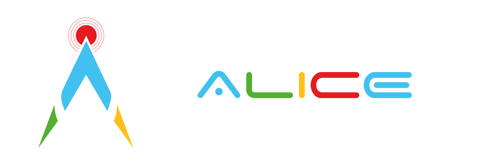

<h3 align="center">
Analisi Live InterContinentale Edotta
 
 
Public PWA telemetry dashboard of <a href=https://www.policumbent.it>Team Policumbent</a> for runs and tests during <a href=http://www.ihpva.org/whpsc/index.htm>WHPSC</a> competition
 
 

<!-- ALL-CONTRIBUTORS-BADGE:START - Do not remove or modify this section -->

<!-- ALL-CONTRIBUTORS-BADGE:END -->

</h3>

## Development

You’ll need to have [Node](https://nodejs.org/en/) `14.16.0` or later version on your local development machine

### `npm start`

Runs the app in development mode.
Open http://localhost:3000 to view it in the browser.

The page will automatically reload if you make changes to the code.
You will see the build errors and lint warnings in the console.

### `npm test`

Runs the test watcher in an interactive mode.
By default, runs tests related to files changed since the last commit.

[Read more about testing.](https://facebook.github.io/create-react-app/docs/running-tests)

## License

[Apache 2.0](https://github.com/policumbent/alice/blob/master/LICENSE)

## Contributors

Thanks goes to these wonderful people ([emoji key](https://allcontributors.org/docs/en/emoji-key)):

<!-- ALL-CONTRIBUTORS-LIST:START - Do not remove or modify this section -->
<!-- prettier-ignore-start -->
<!-- markdownlint-disable -->
<table>
  <tr>
    <td align="center"><a href="https://github.com/gabelluardo"> <b>Gabriele Belluardo</b></a> <a href="https://github.com/policumbent/alice/commits?author=gabelluardo" title="Code">💻</a> <a href="https://github.com/policumbent/alice/commits?author=gabelluardo" title="Documentation">📖</a> <a href="#ideas-gabelluardo" title="Ideas, Planning, & Feedback">🤔</a></td>
    <td align="center"><a href="https://github.com/stelosca96"> <b>Stefano Loscalzo</b></a> <a href="https://github.com/policumbent/alice/commits?author=stelosca96" title="Code">💻</a> <a href="#design-stelosca96" title="Design">🎨</a> <a href="#ideas-stelosca96" title="Ideas, Planning, & Feedback">🤔</a></td>
  </tr>
</table>
<!-- markdownlint-restore -->
<!-- prettier-ignore-end -->
<!-- ALL-CONTRIBUTORS-LIST:END -->

This project follows the [all-contributors](https://github.com/all-contributors/all-contributors) specification. Contributions of any kind welcome!
